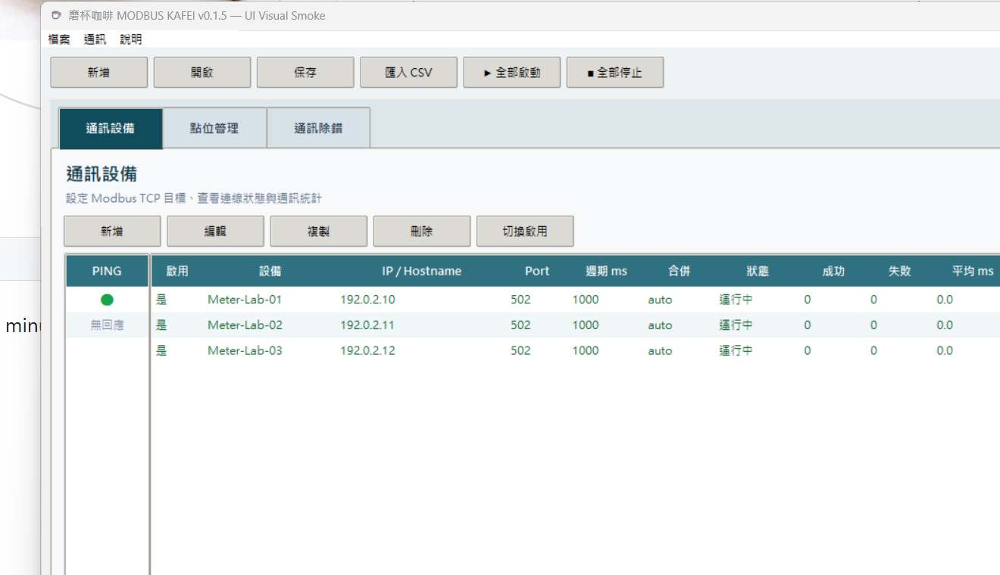
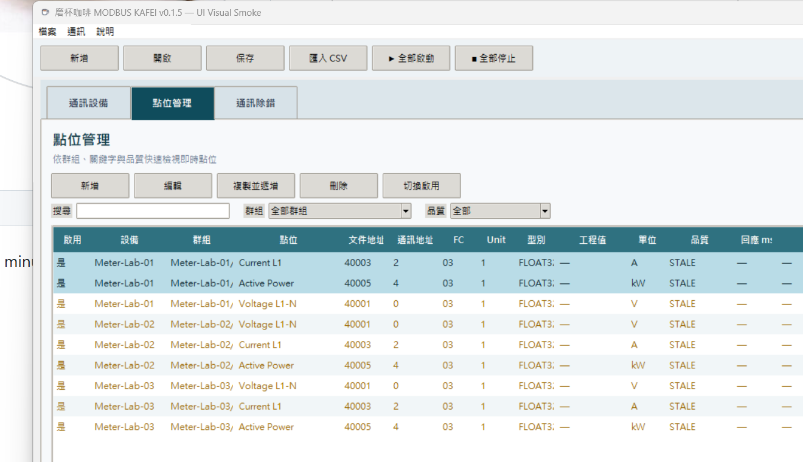
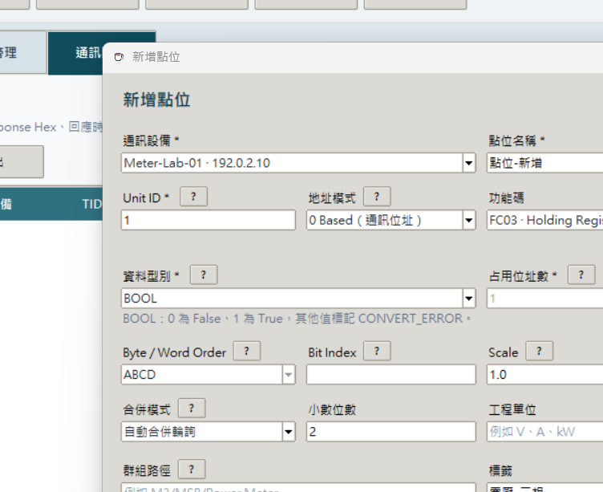

# ☕ MODBUS KAFEI


一套為現場調試而做的 Windows Modbus TCP 設備驗證工具。

> 工具太難用，自己搞一個。

[下載最新版 Windows EXE](https://github.com/tey520/MODBUS-KAFEI/releases/latest) · [功能與驗收邊界](docs/SCOPE.md) · [v0.1.5 驗證紀錄](docs/VALIDATION.md)

## 程式畫面

### 通訊設備



### 點位管理



### 點位設定



## 特色

- 支援 Modbus TCP FC01、FC02、FC03、FC04，專注安全的唯讀驗證。
- 管理設備、Ping 可達狀態、掃描週期、自動重連與通訊統計。
- 管理、複製、排序與群組篩選點位，支援 Shift 範圍選取。
- 明確區分 `0 Based（通訊位址）` 與 `Reference（文件地址）`。
- 支援 BOOL、BIT、INT16、UINT16、INT32、UINT32、FLOAT32、HEX、BINARY、ASCII。
- 支援 Byte / Word Order、Scale、Offset、Bit Index 與位址合併輪詢。
- 即時監控工程值與品質，並提供通訊除錯紀錄。
- 支援 CSV 匯入／匯出與 `.kafei` 專案保存、備份及異常復原。
- 通訊核心僅使用 Python 標準函式庫，不依賴第三方 Modbus 套件。

## 下載與執行

一般使用者請前往 [Releases](https://github.com/tey520/MODBUS-KAFEI/releases) 下載 `MODBUS-KAFEI-v0.1.5.exe`，不需要安裝 Python。

目前 EXE 尚未購買程式碼簽章憑證，Windows 可能顯示「未知的發行者」。請從本專案的 Releases 頁下載，並使用發布頁提供的 SHA-256 核對檔案。

從原始碼執行：

```powershell
git clone https://github.com/tey520/MODBUS-KAFEI.git
cd MODBUS-KAFEI
python run.py
```

需求：Windows、Python 3.10 以上。Tkinter 隨官方 Windows Python 一同提供。

## 測試

```powershell
python -m unittest discover -s tests -t . -v
python run.py --headless-smoke
python scripts/load_smoke.py
```

UI 視覺測試需要 Pillow：

```powershell
python -m pip install -e ".[dev]"
python scripts/ui_visual_smoke.py
```

目前驗證結果為 **38/38 tests passed**。完整紀錄請見 [docs/VALIDATION.md](docs/VALIDATION.md)。

## 建置 Windows EXE

先安裝開發工具，再執行建置腳本：

```powershell
python -m pip install -e ".[dev]"
.\build.cmd
```

輸出位於 `dist/MODBUS-KAFEI-v0.1.5.exe`。

## CSV 最小範例

```csv
device_name,device_host,point_name,unit_id,function_code,address_mode,address,data_type
PLC-Demo,192.0.2.10,Temperature,1,3,reference,40001,FLOAT32
```

`address_mode` 必須明確填入 `zero_based` 或 `reference`；未指定會阻止匯入。

## v0.1.5 範圍

本版不包含 Modbus 寫入、歷史資料、趨勢、告警、Modbus RTU 或 XLSX 直接匯入。定位為設備測試與交付驗證工具；正式現場使用仍應完成實體設備、目標 Windows 環境及耐久測試。

## 圖示授權

咖啡杯圖示原作者為 [thekingphoenix](https://opengameart.org/node/77345)，以 CC0 授權釋出。處理方式與授權紀錄請見 [assets/LICENSE.md](assets/LICENSE.md)。

---

Made with ☕ by [tey520](https://github.com/tey520)
